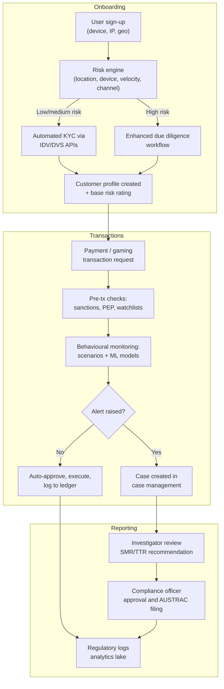
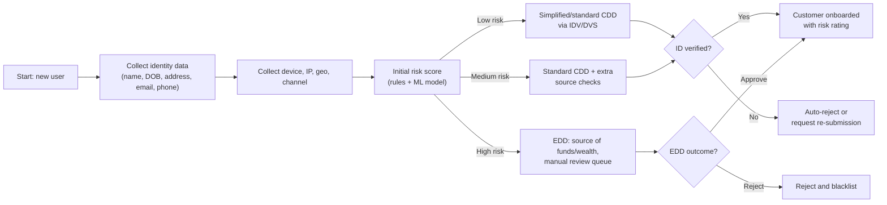
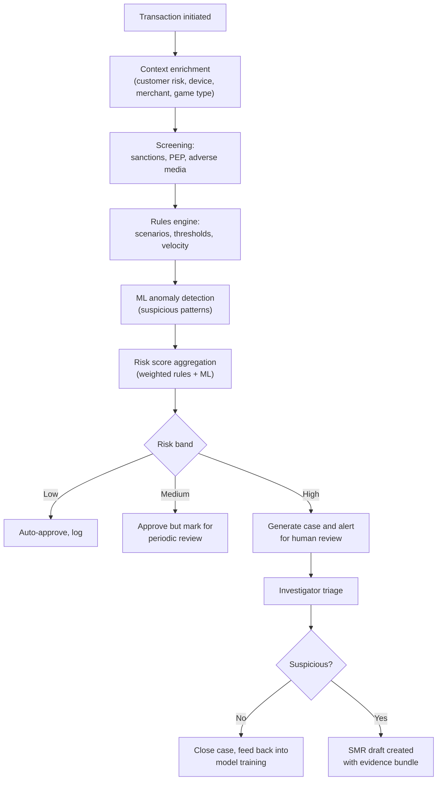
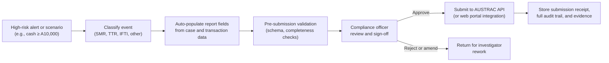

# PaySafeGo AML/CTF Automation

Australian AML/CTF automation architecture for PaySafeGo's Australian launch (gaming and payments).

---

## Regulatory Context (AU)

- **Primary laws**: Anti-Money Laundering and Counter-Terrorism Financing Act 2006 and AML/CTF Rules administered by AUSTRAC.
- **Core Obligations**: Risk-based AML/CTF program, customer identification and verification, ongoing transaction monitoring, and mandatory reporting (SMRs, TTRs, IFTIs), plus 7-year record-keeping and independent program reviews.
- **Reporting Timeframes**:
  - Suspicious Matter Reports (SMRs) for terrorism financing: within **24 hours**
  - SMRs for other suspicions (ML, fraud, etc.): within **3 business days**
  - Threshold Transaction Reports (TTRs): within **10 business days**
  - International Funds Transfer Instructions (IFTIs): within **10 business days**
- **TTR Threshold**: A$10,000 or more in physical cash (or foreign currency equivalent).
- **Compliance Deadlines**: Existing entities March 31, 2026; Tranche 2 professionals July 1, 2026.

---

## Design Objectives

- Maximise straight-through processing (STP) with explainable decisioning and minimal manual steps.
- Maintain clear human accountability where law or risk justifies it (e.g., SMR approval, EDD decisions, program oversight).
- Embed privacy by design, least privilege, and robust audit trails for all automated decisions.

---

## High-Level Architecture

- **Onboarding and CDD**: Identity proofing, risk assessment, and customer profiling.
- **Transaction Monitoring**: Real-time and near-real-time rules and ML-based monitoring, sanctions/PEP/adverse media screening.
- **Reporting and Records**: Automated report generation, AUSTRAC submissions, immutable logging, and evidence store.
- **Governance**: Policy engine, model oversight, compliance dashboards, and independent review support.

---

## End-to-End Flowchart

---

## Onboarding and CDD Flow

---

## Transaction Monitoring Flow

---

## Reporting and Record-Keeping Flow

---

## Automation Boundaries

- **Fully automatable**: Identity data capture, risk scoring, sanctions/PEP screening, rules/ML monitoring, report drafting, data retention, and analytics.
- **Requires human oversight**: SMR content and submission decisions, EDD outcomes, changes to risk appetite, and independent reviews of the AML/CTF program per AUSTRAC requirements.

---

## Onboarding Automation Components

- **Identity Verification**: Integrate with Australian DVS (Document Verification Service) or commercial IDV providers (document and biometric checks, liveness detection, fraud signals).
- **Risk Engine**: Rules plus ML combining identity, device, geolocation, channel, and behavioural features to assign initial risk bands.
- **KYC/KYB Data Sources**: Company registries, credit header data, and watchlists for business customers where applicable.

---

## Transaction Monitoring Components

- **Scenario Library**: Structuring, smurfing, rapid in/out, chip-cashing, and bonus abuse scenarios tailored to gaming and payment transaction patterns.
- **ML Layer**: Anomaly detection, peer-group analysis, and network analytics to uncover complex laundering patterns.
- **Feedback Loop**: Investigator dispositions feed model re-training and rule tuning to continuously reduce false positives and improve detection accuracy.

---

## Reporting Automation Components

- **Rule-Based Triggers**: 
  - TTR triggers: Cash transactions ≥ A$10,000
  - IFTI triggers: All international funds transfers (any amount)
  - SMR triggers: Suspicion of money laundering, terrorism financing, or other criminal activity
- **AUSTRAC Integration**: API or secure upload to generate and submit reports with validation and acknowledgments.
- **Evidence Bundling**: Automatically attach transactions, KYC data, investigator notes, and model explanations to each report for full auditability.

---

## Governance and Oversight

- **AML/CTF Compliance Officer**: Accountable for program design, effectiveness, and regulatory engagement with AUSTRAC.
- **Independent Review**: Periodic external review of AML/CTF program, models, and data quality as required by AUSTRAC regulations.
- **Model Risk Management**: Validation, back-testing, documentation, and change control for all rules and ML models per AML/CTF Rules 2025.

---

## Implementation Roadmap (12–18 Months)

1. **Foundation (Months 0–3)**: Regulatory requirements analysis, data model design, initial risk taxonomy, and compliance readiness assessment.
2. **MVP (Months 3–6)**: Core onboarding automation, sanctions/PEP screening, basic rules engine, and manual reporting with auto-drafted SMR/TTR templates.
3. **Scale (Months 6–12)**: ML-based transaction monitoring, AUSTRAC API integration, compliance dashboards, and case management system tuning.
4. **Optimisation (Months 12–18)**: Model refinement, advanced gaming transaction typologies, and preparing for independent program review.

---

## Key Notes

- This markdown is structured for Marp-style dark-theme slides (dark background, light text).
- GitHub renders it as standard markdown; you can render slides using Marp CLI or VS Code extension while preserving the dark theme.
- All regulatory references reflect AUSTRAC AML/CTF Rules 2025 and compliance deadlines effective 2026.