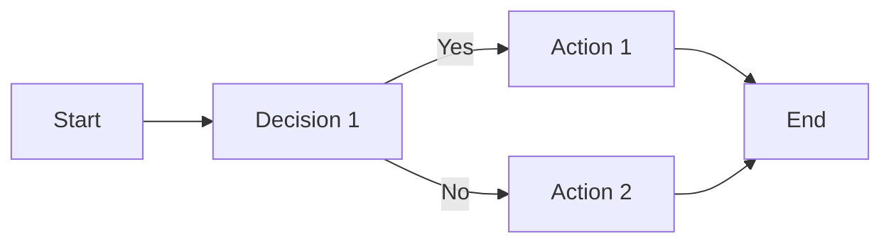

```mermaid
%%{init: {"themeVariables": {"primaryColor": "#ffcc00"}}}%%

graph LR;
    A[Start] --> B[Decision 1];
    B -->|Yes| C[Action 1];
    B -->|No| D[Action 2];
    C --> E[End];
    D --> E;
```